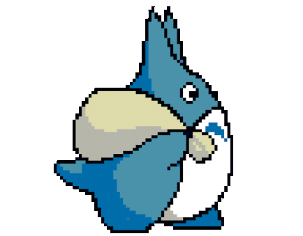

 
 

  

 <h1> Sobre mí </h1>

 🌐 Estudiando diseño web | 🌎 Apasionado por los idiomas | 📕 Inglés C1

<h1> Sociales </h1>

<h1>Mis tecnologías </h1>
  

  

<!-- Proudly created with GPRM ( https://gprm.itsvg.in ) -->
